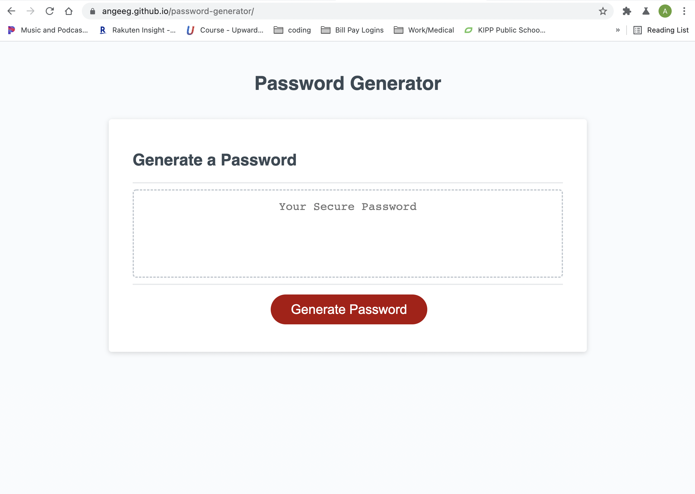

# password-generator

## Description 
If you're in need of a secure password but don't know what to choose this app is for you. Once the application is opened, click the generate password button and follow the prompts to create a randomized secure password that no one will be able to guess. 
## Installation
1. Open your machine's terminal and navigate to the directory you want to save the application in.
2. Run 'git clone https://github.com/angeeg/password-generator.git' in the command line.
3. Open the cloned repo in your code editor. 
4. Right click in the 'index.html' file and select 'Open in Default Browser' to open the application in your web browser.
## Usage 
View the live website [here](https://angeeg.github.io/password-generator/). Follow the prompts to generate your unique password.

Use this website to generate a secure, random, and unique password that no one will be able to figure out. 

## Credit 
This code was refactored by <a href="https://github.com/angeeg">angeeg</a>.

## Questions
If you have any questions or run into any issues with the website please contact <a href="https://github.com/angeeg">angeeg</a>.
